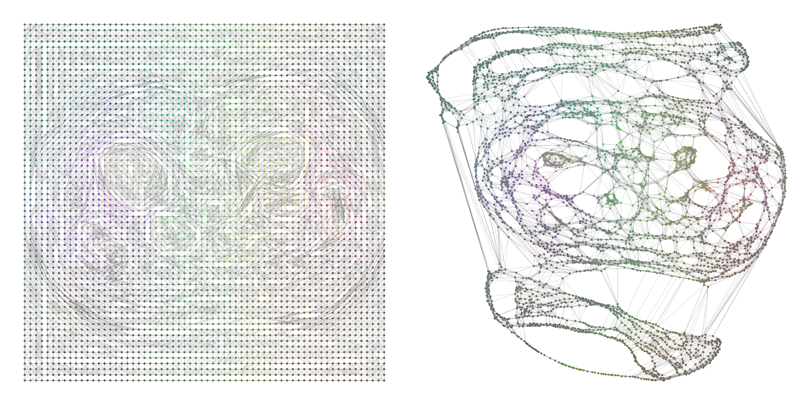

# C-Graph
[]()
[]()

Official code for paper: Contrastive Graph Modeling for Cross-domain Few-shot Medical Image Segmentation

  


- [News!] 2025-06-03: We have uploaded the full code.
- [News!] 2025-06-13: We have uploaded the model weights and prediction maps. As of now, all our experimental code and results have been open-sourced. We are still actively updating this repository for better result presentation. Stay tuned!
- [News!] 2025-12-25 🎄: Our paper has been accepted for publication in IEEE Transactions on Medical Imaging! 🎅🎁

### ✅ TODO List
- [x] Release model code.
- [x] Release model weights.
- [x] Release model prediction maps.

## 📋 Abstract
Cross-domain few-shot medical image segmentation (CD-FSMIS) offers a promising and data-efficient solution for medical applications where annotations are severely scarce and multimodal analysis is required.
However, existing methods typically filter out domain-specific information to improve generalization, which inadvertently limits cross-domain performance and degrades source-domain accuracy.
To address this, we present Contrastive Graph Modeling (C-Graph), a framework that leverages the structural consistency of medical images as a reliable domain-transferable prior. We represent image features as graphs, with pixels as nodes and semantic affinities as edges. A Structural Prior Graph (SPG) layer is proposed to capture and transfer target-category node dependencies and enable global structure modeling through explicit node interactions. Building upon SPG layers, we introduce a Subgraph Matching Decoding (SMD) mechanism that exploits semantic relations among nodes to guide prediction. Furthermore, we design a Confusion-minimizing Node Contrast (CNC) loss to mitigate node ambiguity and subgraph heterogeneity by contrastively enhancing node discriminability in the graph space.
Our method significantly outperforms prior CD-FSMIS approaches across multiple cross-domain benchmarks, achieving state-of-the-art performance while simultaneously preserving strong segmentation accuracy on the source domain.

## 🤓 Modeling Anatomy as Graphs
<p align="center">
  
  <br>
  <em>
The anatomical structures in medical images can be learned as graphs and serve as transferable priors across different imaging domains.
  </em>
</p>

## ⏳ Quick start

### 🛠 Dependencies
Please install the following essential dependencies:
```
dcm2nii
json5==0.8.5
jupyter==1.0.0
nibabel==2.5.1
numpy==1.22.0
opencv-python==4.5.5.62
Pillow>=8.1.1
sacred==0.8.2
scikit-image==0.18.3
SimpleITK==1.2.3
torch==1.10.2
torchvision=0.11.2
tqdm==4.62.3
```


### 📚 Datasets and Preprocessing
Please download:
1) **Abdominal MRI**: [Combined Healthy Abdominal Organ Segmentation dataset](https://chaos.grand-challenge.org/)
2) **Abdominal CT**: [Multi-Atlas Abdomen Labeling Challenge](https://www.synapse.org/#!Synapse:syn3193805/wiki/218292)
3) **Cardiac LGE and b-SSFP**: [Multi-sequence Cardiac MRI Segmentation dataset](https://zmiclab.github.io/zxh/0/mscmrseg19/index.html)


Pre-processing is performed according to [Ouyang et al.](https://github.com/cheng-01037/Self-supervised-Fewshot-Medical-Image-Segmentation/tree/2f2a22b74890cb9ad5e56ac234ea02b9f1c7a535) and we follow the procedure on their GitHub repository.

### 

### 🔥 Training
1. Compile `./data/supervoxels/felzenszwalb_3d_cy.pyx` with cython (`python ./data/supervoxels/setup.py build_ext --inplace`) and run `./data/supervoxels/generate_supervoxels.py`
2. Download pre-trained ResNet-50 weights [deeplabv3 version](https://download.pytorch.org/models/deeplabv3_resnet50_coco-cd0a2569.pth) and put your checkpoints folder, then replace the absolute path in the code `./models/encoder.py`.  
3. Run `./script/train_<direction>.sh`, for example: `./script/train_ct2mr.sh`


### 🔍 Inference

1. *(Optional)* You can download our [pretrained models](https://drive.google.com/drive/folders/1Bi5o3Lwe7n6JjVlSdh31HP9boPCOxhND?usp=sharing) for different domains:

   * **Abdominal CT**: [Google Drive](https://drive.google.com/drive/folders/1LDm3-hndaWiVnwrpxSP3jL_K2wKhoRN8?usp=sharing)
   * **Abdominal MRI**: [Google Drive](https://drive.google.com/drive/folders/1fi9DfOlYWR3-r6czu-oT_ZpBjHmrs3bj?usp=sharing)
   * **Cardiac LGE**: [Google Drive](https://drive.google.com/drive/folders/1dOP3yja37S6lWllXT8fG_BviuzEg7Eiz?usp=sharing)
   * **Cardiac b-SSFP**: [Google Drive](https://drive.google.com/drive/folders/1ZQ0p2J8xLu0e16iKzOofqF6mRw-UaMh-?usp=sharing)

   After downloading, update the path accordingly in the test script.

2. Run the following script to perform inference: `./script/test_<direction>.sh`

3.  🖼️ Prediction maps for the four cross-domain directions are available [**here**](https://drive.google.com/drive/folders/1mHLGbVeI-ghvsbGB19QsGkz0hDX5WWuP?usp=sharing) — perfect for a quick glance!


## 🥰 Acknowledgements
Our code is built upon the works of [SSL-ALPNet](https://github.com/cheng-01037/Self-supervised-Fewshot-Medical-Image-Segmentation), [ADNet](https://github.com/sha168/ADNet) and [ViG](https://github.com/huawei-noah/Efficient-AI-Backbones), we appreciate the authors for their excellent contributions!


